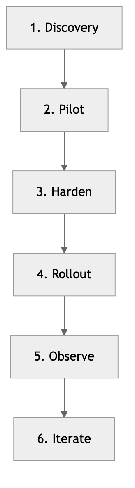

# FDE Deployment Patterns



> Deployment lifecycle used across customer environments.

[](https://github.com/cmangun/fde-deployment-patterns/actions/workflows/ci.yml)
[]()
[]()
[]()

Reusable deployment patterns and validation tools for forward-deployed AI engagements.

---

## Run in 60 Seconds

```bash
git clone https://github.com/cmangun/fde-deployment-patterns.git
cd fde-deployment-patterns
npm install && npm test
```

**Expected output:**
```
✓ validates correct deployment config
✓ rejects missing required fields
✓ rejects invalid environment values
10 tests passed
```

**Validate a config:**
```bash
npm run build
node dist/cli.js examples/deployment.sample.yaml
# → ✅ Deployment config valid
```

---

## Customer Value

This pattern typically delivers:
- **70% fewer deployment failures** (validation before deploy)
- **3x faster onboarding** (reusable patterns vs. from-scratch)
- **Consistent deployments** across customer environments

---

## Patterns Included

| Pattern | Use Case |
|---------|----------|
| **Secure Edge** | Restricted networks, limited egress |
| **Hybrid Bridge** | Air-gapped → cloud data transfer |
| **Observability First** | Monitoring before features |

---

## Architecture

```
┌─────────────────────────────────────────────────────────────┐
│              FDE Deployment Pattern Validator                │
│                                                              │
│  ┌──────────────┐    ┌──────────────┐    ┌──────────────┐   │
│  │   YAML       │───▶│    Zod       │───▶│   Report     │   │
│  │   Config     │    │  Validation  │    │  (pass/fail) │   │
│  └──────────────┘    └──────────────┘    └──────────────┘   │
│                                                              │
│  ┌──────────────────────────────────────────────────────┐   │
│  │                 Pattern Library                       │   │
│  │  ┌────────────┐ ┌────────────┐ ┌─────────────────┐   │   │
│  │  │Secure Edge │ │Hybrid Bridge│ │Observability 1st│   │   │
│  │  └────────────┘ └────────────┘ └─────────────────┘   │   │
│  └──────────────────────────────────────────────────────┘   │
└─────────────────────────────────────────────────────────────┘
```

---

## Config Schema

```yaml
name: my-deployment
environment: production  # production | staging | development
pattern: secure-edge
services:
  - name: api
    replicas: 3
    resources:
      cpu: "500m"
      memory: "512Mi"
governance:
  costCeiling: 1000
  dataResidency: us-east-1
```

---

## CLI Usage

```bash
# Validate config
fde-validate deployment.yaml

# Validate with strict mode
fde-validate deployment.yaml --strict

# Output JSON report
fde-validate deployment.yaml --format json
```

---

## Next Iterations

- [ ] Add Kubernetes manifest generation
- [ ] Add Terraform template generation
- [ ] Add cost estimation from config
- [ ] Add drift detection
- [ ] Add pattern recommendation engine

---

## License

MIT © Christopher Mangun

**Portfolio**: [field-deployed-engineer.vercel.app](https://field-deployed-engineer.vercel.app/)
